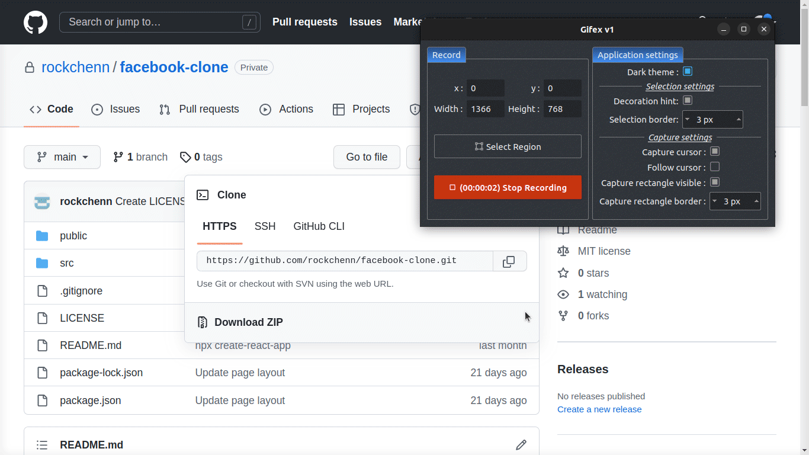
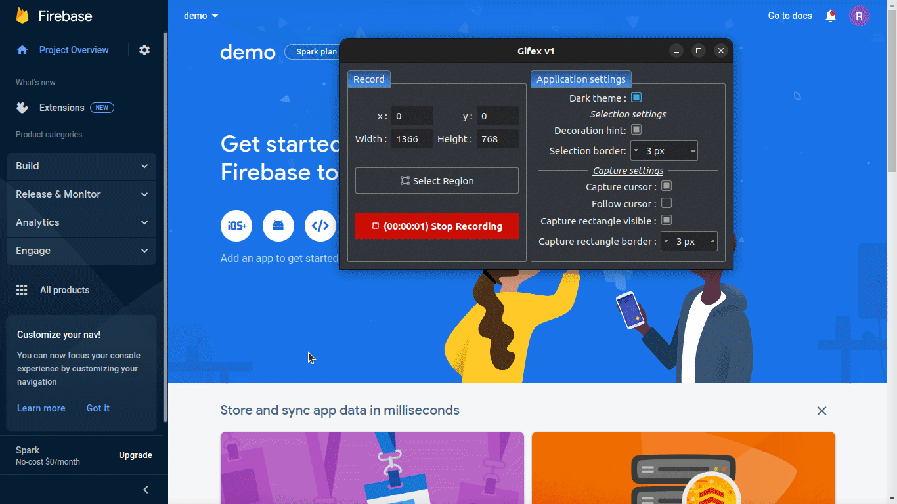
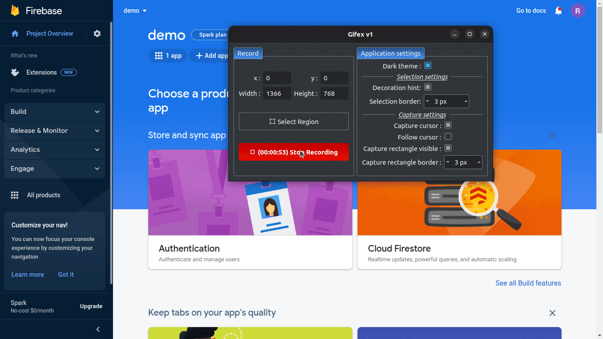
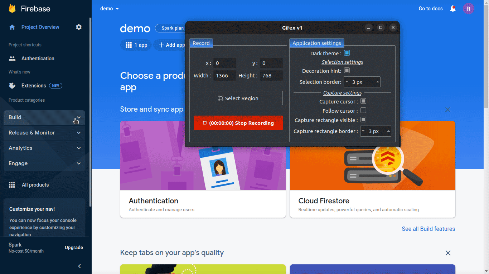
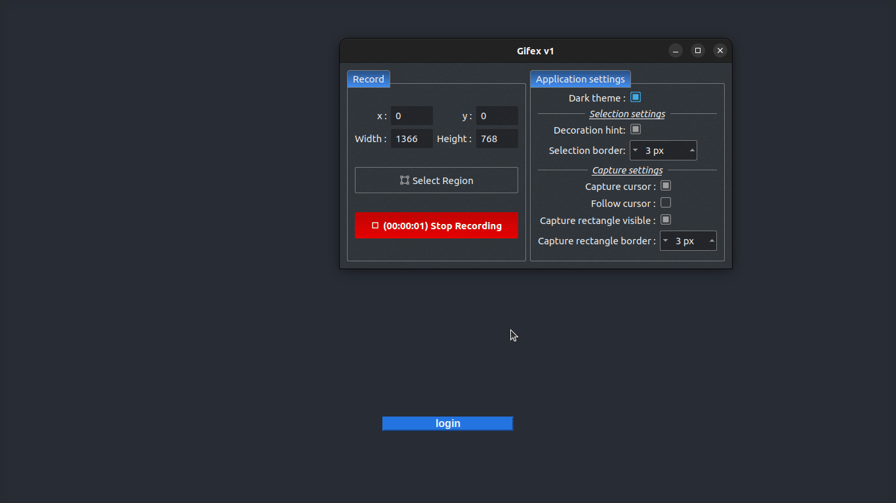

# About

I'd like to learn react by building something real, familiar, and funny.  
This repo is created after watching this inspiring youtube video [Build a Facebook Clone with REACT JS for Beginners!](https://youtu.be/B-kxUMHBxNo).  
It's a dark theme and layout like facebook web page with the following functions:
- Authentication provided by Google.
- Create posts with text and image.
- Search in posts.

# Get Started

## Clone the project and install dependencies
```
git clone https://github.com/rockchenn/facebook-clone.git
cd facebook-clone
npm install
```

## Setup firebase
This repo requires firebase services including authentation, firestore, and storage.  
The following animations just provides an quick setup for you to test and see it but without any security rule.  
Please follow firebase docs to learn how to come out the rules you need. 

### Create a firebase project

#
### Add an app and setup firebase configuration in src/firebase.js

#
### Add authentication service

#
### Add firestore service and replace the rule with the following one

```
rules_version = '2';
service cloud.firestore {
  match /databases/{database}/documents {
    match /{document=**} {
      allow read, write;
    }
  }
}
```
#
### Add storage service like firestore and replace the rule with the following one
```
rules_version = '2';
service firebase.storage {
  match /b/{bucket}/o {
    match /{allPaths=**} {
      allow read, write;
    }
  }
}
```

## Start the web page
```
npm start
```
# Screenshots
## Login

## Create new post

## Search in posts
